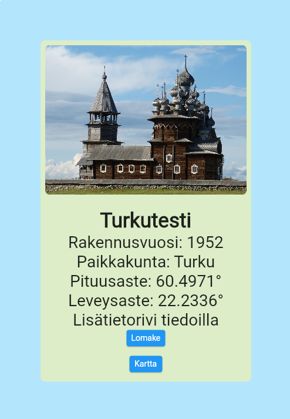
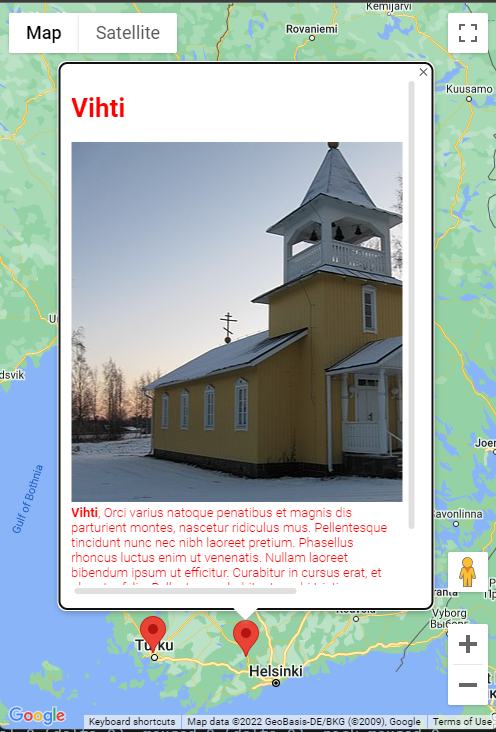
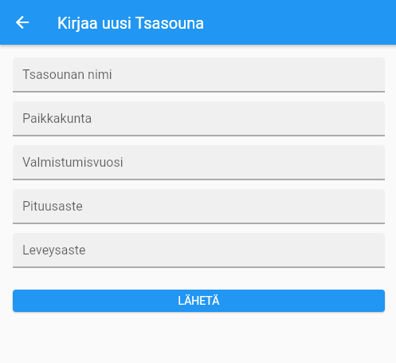

# TsasounaWeb - Rakennukset kartalla

Konsepti siitä, mikä "Suomen ortodoksia tsasounia" -kirjan (https://tsasounia.fi) apusovellus olisi voinut olla. Sovellukseen syötetään rakennusten tiedot, koordinaatit ja kommentit. Nämä tallentuvat Firestore-tietokantaan ja sen perusteella tiedot listataan sovelluksen listaus- ja karttanäkymissä automaattisesti.

Sovellus ohjelmoitiin Dartilla ja se käyttää Flutter-kirjastoa. Sovellus on ensisijaisesti selaimella käytettävä, mutta sen voi lisätä PWA-webbisovelluksena Android-älypuhelimiin. Karttarajapintana toimii Google Maps, jonka näyttökerrosta laajennettiin vastaamaan paremmin tämän sovelluksen tarpeita.

Sovellus on nähtävillä lukutilassa osoitteessa https://dawcules.github.io (uusien rakennusten syöttäminen on estetty).

   

